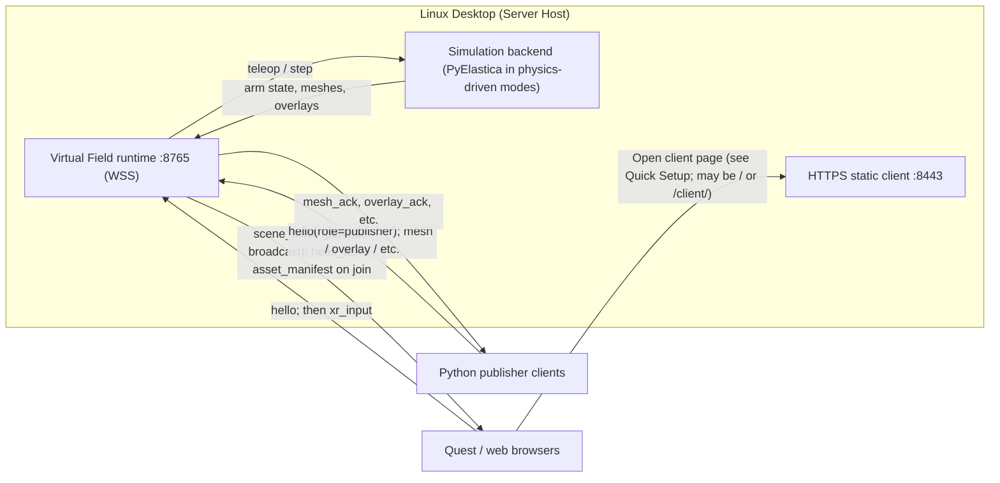

# VR Prototype Interface

This folder contains the Quest WebXR client and startup scripts for the multi-user soft-arm VR prototype powered by the `virtual_field` package.
Deployment model:
- Linux desktop starts and hosts the VR services.
- Clients join over URLs:
  - Headgear client opens HTTPS URL in Quest Browser.
  - Object-publisher client connects to WSS URL from Python CLI.

## Join the VR environment

Before joining, use the top-right panel:
- Choose `Character` (`Demo-spline`, `Two CR`, ...).
- Click `Join Field`.
    - You can join as a spectator by clicking `Join as Spectator`.
    - You can joint arm camera view by clicking `Join Arm Camera`.
- Click `Enter VR` to enter the VR environment.
    - This will start the VR session.
- If you are using a headgear, you can click `Enter VR` on the bottom to enter the immersion mode.

## Quick Setup

Use `npx` or `bunx`, depending on your preference.

### Serve the WebXR client over HTTPS

Serve the WebXR client over HTTPS:

```bash
# In VR directory
npx serve client -l 8443 --ssl-cert certs/dev-cert.pem --ssl-key certs/dev-key.pem
# or
bunx serve client -l 8443 --ssl-cert certs/dev-cert.pem --ssl-key certs/dev-key.pem
```
### Start runtime server

> This requires a python environment with all packages installed.

```bash
./VR/scripts/start_server.sh
```

### Open on Quest Browser (replace `YOUR_SERVER_IP` to your IP or domain name):

> Note: You can also open the client URL in your browser.
> I have not tested, but some VR immerse emulator plugin exists.

```text
https://YOUR_SERVER_IP:8443/
```

The client now auto-derives websocket endpoint from page host:
- `https://HOST:8443` -> `wss://HOST:8765`
- `http://HOST:...` -> `ws://HOST:8765`

> You can still override with `?ws=...` or custom port via `?ws_port=...`.

## Character modes:

- `Demo-spline`: current spline demo behavior.
- `Two CR`: always 2 arms, base is fixed near body center, and base movement controls are disabled. Controller targets are sent to the server, and the server runs `PyElastica` to compute the rod posture.

## Python mesh publisher (remote LAN machine)

Another machine on the same LAN (for example a Macbook) can publish mesh/scenery files into the shared VR scene by connecting to the Linux host WSS URL.

> TODO

1. Install python-packages on the publisher machine.
2. Run:


## System diagram


