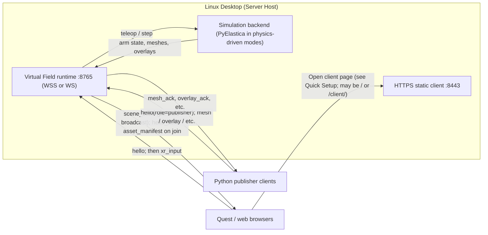

# VR Prototype Interface

This folder contains the Quest WebXR client and startup scripts for the multi-user soft-arm VR prototype powered by the `virtual_field` package.
Deployment model:
- Linux desktop starts and hosts the VR services.
- Clients join over URLs:
  - Headgear client opens HTTPS URL in Quest Browser.
  - Object-publisher and other tools connect to the runtime WebSocket URL (`wss://` when the server uses TLS, `ws://` when it does not).

## Join the VR environment

Before joining, use the top-right panel:
- Choose `Character` (`Demo-spline`, `Two CR`, ...).
- Click `Join Field`.
    - You can join as a spectator by clicking `Join as Spectator`.
    - You can joint arm camera view by clicking `Join Arm Camera`.
- Click `Enter VR` to enter the VR environment.
    - This will start the VR session.
- If you are using a headgear, you can click `Enter VR` on the bottom to enter the immersion mode.

## Quick Setup

Use `npx` or `bunx`, depending on your preference.

### Serve the WebXR client over HTTPS

Serve the WebXR client over HTTPS:

```bash
# In VR directory
npx serve client -l 8443 --ssl-cert certs/dev-cert.pem --ssl-key certs/dev-key.pem
# or
bunx serve client -l 8443 --ssl-cert certs/dev-cert.pem --ssl-key certs/dev-key.pem
```

#### Generate a dev certificate

1. Generate a dev certificate (use your server LAN IP or hostname):

```bash
./VR/scripts/generate_dev_cert.sh YOUR_SERVER_IP
```

### Start runtime server

> This requires a python environment with all packages installed.

```bash
./VR/scripts/start_server.sh
```

You can also run the module directly, with or without TLS:

```bash
# Without TLS
uv run --no-sync python -m virtual_field.server.app --host 0.0.0.0 --port 8765
# With TLS
uv run --no-sync python -m virtual_field.server.app --host 0.0.0.0 --port 8765 \
  --ssl-cert VR/certs/dev-cert.pem --ssl-key VR/certs/dev-key.pem
```

### Open on Quest Browser (replace `YOUR_SERVER_IP` to your IP or domain name):

> Note: You can also open the client URL in your browser.
> I have not tested, but some VR immerse emulator plugin exists.

```text
https://YOUR_SERVER_IP:8443/
```

The client auto-derives the WebSocket URL from the page URL (`VR/client/app/config.js`):

- `https://HOST:8443` → default `wss://HOST:8765`
- `http://HOST:...` → default `ws://HOST:8765`

**HTTPS client pages require `wss://`** for the WebSocket (browsers treat `ws://` from an HTTPS page as mixed content and block it). For Quest Browser and the documented `https://…:8443` flow, generate certs and run the runtime with TLS so defaults match (`wss://HOST:8765`).

For **local HTTP** client URLs (for example `http://localhost:8080`), the default is `ws://…:8765`, which matches a non-TLS runtime. You can still force `ws` with `?ws_insecure=1` or set an explicit `?ws=ws://HOST:8765` when the page context allows it.

> Override the endpoint with `?ws=...` or only the port with `?ws_port=...`.

The WebSocket logic lives in `VR/client/network/socket_client.js`. `socket_client_wss.js` re-exports the same implementation so you do not need to swap files for TLS vs non-TLS.

## Character modes:

- `Demo-spline`: current spline demo behavior.
- `Two CR`: always 2 arms, base is fixed near body center, and base movement controls are disabled. Controller targets are sent to the server, and the server runs `PyElastica` to compute the rod posture.

## Python mesh publisher (remote LAN machine)

Another machine on the same LAN (for example a Macbook) can publish mesh/scenery files into the shared VR scene by connecting to the Linux host WSS URL.

> TODO

1. Install python-packages on the publisher machine.
2. Run:


## System diagram


