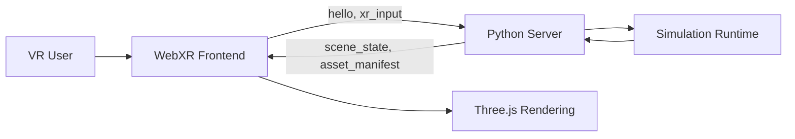

# VR Frontend Intro

The VR frontend is a lightweight WebXR client for interacting with the Virtual Field runtime from a headset browser.
Its job is not to run the soft-body simulation locally.
Instead, it captures head and controller input, sends that input to the Python server, and renders the scene state that comes back.

At a high level, the frontend is responsible for:

- starting a WebXR session in the browser
- collecting controller pose, buttons, grip, trigger, and joystick input
- sending `hello` and `xr_input` messages over websocket
- rendering returned arm state, meshes, spheres, and overlay points
- showing a small amount of client-side debug and join-session UI

For simulation-backed modes, the browser acts mainly as an input and visualization layer.
The physics, mode logic, and scene updates are owned by the Python backend.

In short:

- the headset provides live XR input
- the Python side interprets that input and advances the simulation
- the frontend renders whatever scene state the server publishes

This separation keeps the frontend simple and makes it easier to swap or extend simulation modes without rewriting the browser client.
