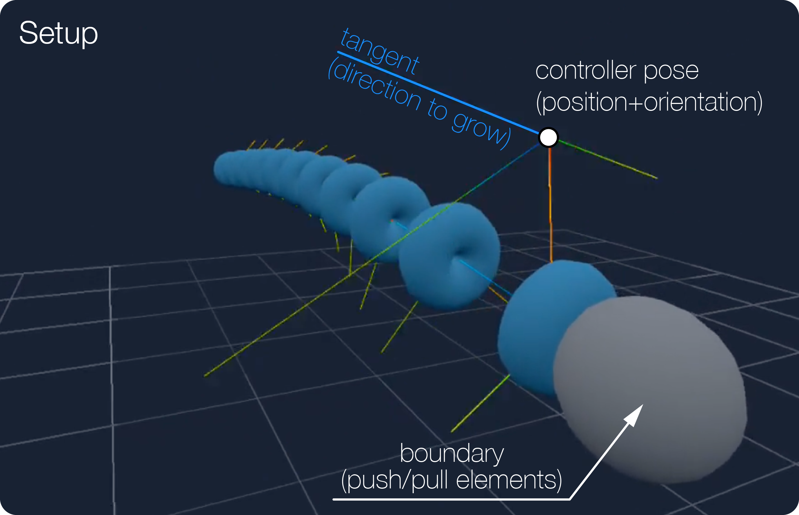
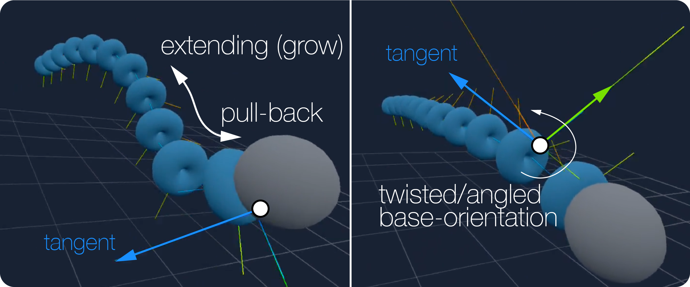
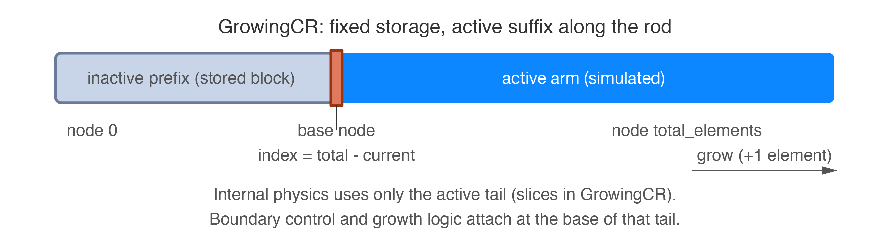

(vf-growing-arm)=
# Growing arm (GrowingCR + boundary control)

## Introduction

The **growing arm** setup pairs a storage-backed Cosserat rod (`GrowingCR`) with
boundary forcing that acts like a **turret** at the base of the active segment
and **discrete growth** when the user adds or removes elements. The same idea
backs dual-arm demos in the Virtual Field runtime: fixed bases in the world,
tracked controller orientation, and buttons to extend or retract the simulated
length.

The figures below are taken from that workflow: how the scene is arranged, how
targeting maps to the base, and a short loop of growth in VR.

This page explains the **mechanism**: a fixed-capacity rod where only a **suffix**
of elements is simulated, the rest folded as **storage**; `_GrowingCRBoundaryConditions`
applies PD at that suffix base and resizes `current_elements` on triggers.

## Mental model: active suffix

The implementation is `GrowingCR` in
`src/virtual_field/runtime/custom_elastica/rods/growing_cr.py`. Arrays are
allocated for `total_elements`, but `current_elements` controls how many elements
from the **end** of the array participate in internal forces, damping, and
integration. Equivalently, physics uses slices `[-current_elements:]` on
per-element data and the last `current_elements + 1` nodes.

At build time, `growing_cr_allocate` lays out a straight rod so the **inactive**
prefix sits near the base and the **active** segment points along the desired
direction; the **base** of the simulated arm is the first node of the active
suffix, at index `total_elements - current_elements`.

Editor and GitHub **Markdown previews** only render ordinary `` image
links like the lines above. They do not run Sphinx, so fenced `image` directives
would show as raw text. After `sphinx-build` or `make html` in `docs/`, open
`_build/html/custom_elastica/growing_arm.html` in a browser (or use hosted docs)
to see the full themed layout.

## What `_GrowingCRBoundaryConditions` does

The class in
`src/virtual_field/runtime/custom_elastica/boundary_conditions.py` subclasses
PyElastica’s `NoForces` and runs each step as **forcing** on the rod.

1. **Turret tracking**  
   A callable `controller()` returns a world-frame rotation matrix (and a
   position that is currently unused). The base of the active segment is pulled
   toward a fixed `target_position` with gain `p_linear_value`, and its
   directors are aligned to the controller orientation with gain
   `p_angular_value`. The torque uses the rotation vector from the relative
   rotation (SO(3) logarithm / inverse Rodrigues construction), including a
   stable branch near π.

2. **Growth / shrink**  
   Two booleans, `trigger_increase_elements` and `trigger_decrease_elements`,
   request changing `current_elements`. A short **debounce** (0.3 s) avoids
   repeated toggles.  
   - **Increase** (when `current_elements < total_elements`): increment
     `current_elements`, then call `_reset_element_kinematics_and_strains` on the
     new base index so the newly exposed segment is snapped to rest length,
     inherits directors from its neighbor, and clears spurious velocity/angular
     rates at that joint.  
   - **Decrease** (when `current_elements > min_elements`): decrement
     `current_elements` only; the shorter active prefix leaves the folded
     storage as-is for the next steps.

3. **Ramp** (artifact from rest of the PyElastica) 
   `ramp_up_time` scales both linear and angular efforts by
   `min(1, time / ramp_up_time)` so startup does not impulse the rod (in typical
   setups `ramp_up_time` is chosen very small).

Together, this replaces a classical **fixed** base constraint: the base **moves**
with the user’s aim while the arm length changes on discrete button edges.

## Example wiring

`TwoGCRSimulation` (`src/virtual_field/runtime/two_gcr_simulation.py`) builds two
`GrowingCR` rods with `total_elements = 5 * n_elem` and `current_elements =
n_elem`, then attaches `_GrowingCRBoundaryConditions` with:

- `target_position` at each arm’s fixed base in the scene,
- `controller` returning the tracked controller pose for that arm,
- **primary** button: decrease length,
- **secondary** button: increase length (edge-triggered in `handle_commands`).

That pairing is one concrete UX; the boundary class only needs the triggers and
controller you provide.