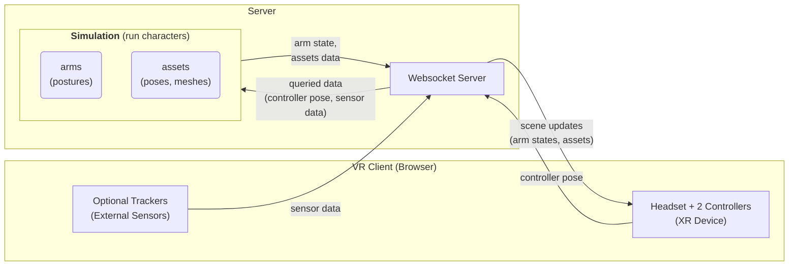

# Introduction to Virtual Field Utilities

Virtual Field utilities are the simulation backends that operates the WebXR runtime in
`src/virtual_field`.

When a VR client connects, it requests a `character_mode`. That mode determines
which simulation class is created, how controller targets are interpreted, and
which scene objects are published back to the browser.

## Terminology

- **Pose**: position and orientation, se3 group element.
- **Posture**: a collection of poses for a character's arms and objects. (i.e. Cosserat rod posture)
- **Character**: a person with its own pose (i.e. headset pose) with other signals from controllers/sensors.
    - Each character has its own pose in the virtual field, and it can have multiple arms or objects.

## What a mode controls

A Virtual Field helps to define:

- the simulated arm mechanics
- how XR controller pose drives the simulation
- optional environment assets such as meshes or spheres
- optional button-triggered interactions such as grab, reset, or suction 
    - Figuring out the physics and optimizing the code is user's responsibility

In the current runtime, built-in simulation modes are standardized around the
`dual-arm` case. The backend allocates two arms for registered simulation modes
and expects the mode class to publish state for those two arms.

> [TODO;note] Multi-arm case is also supported, but the generalized interface is not yet implemented.

Following diagram shows part of communication flow between the simulator and websocket server during the runtime.

- Upon querying, the websocket server sends the sensor and controller data to the simulation.
- The simulation steps forward and publishes the arm state and optional assets back to the websocket server.
- The websocket server broadcasts the scene updates to the user with WebXR gear.

## How to add a new mode

1. Create a new module in `src/virtual_field/runtime/`
    - By convention, keep the script name <mode_name>_simulation.py
    - Necessary elastica custom classes can be placed in `src/virtual_field/runtime/<mode_name>_elastica/`
    - Common utilities or elastica classes are placed in `src/virtual_field/runtime/custom_elastica/`
2. The websocket server validates that name against `SIMULATION_FACTORIES` in `src/virtual_field/runtime/mode_registry.py`

Follow the next tutorials to see the details of how to implement a new mode.